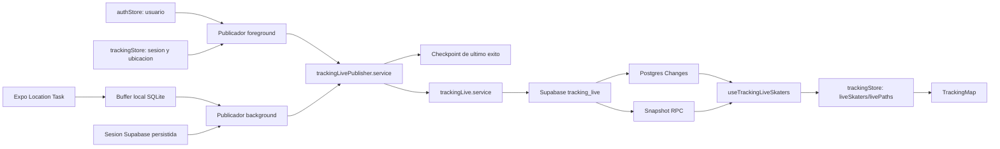

# Tracking Live Reliability Fix

## Identidad

- Rama base: `develop`
- Commit base: `5790762b`
- Rama de trabajo: `codex/fix-live-tracking-only`
- Commit live trasladado: `56be73d2`
- Plataforma prioritaria: Android
- Backend: Supabase `fmkwqfnvtpuqtpgkengs`
- Alcance: publicacion, recepcion, reconciliacion y render de tracking live.

Este documento es la guia permanente del fix de live tracking. No reemplaza
`DOCS/TRACKING_MAP_ONLY_REFACTOR.md`; desarrolla exclusivamente el punto 10.

## Objetivo

Dos o mas usuarios autenticados deben verse mutuamente mientras sus sesiones de
tracking publicas estan activas. El resultado debe ser consistente entre
Android y Android, Android y iPhone, y posteriormente iPhone y iPhone.

En Android, si una sesion publica sigue capturando ubicacion con la pantalla
bloqueada o con otra aplicacion visible, esas actualizaciones tambien deben
llegar al receptor live. La continuidad local y la continuidad remota son dos
entregas distintas y ambas deben poder verificarse.

Este fix no puede cambiar:

- captura GPS local;
- filtros de coordenadas de la ruta local;
- segmentos, distancia o metricas;
- pausa, reanudacion, Stop o auto-stop;
- persistencia e hidratacion de rutas;
- comportamiento de la camara del usuario local.

## Sintomas reportados

- Android hacia iPhone llego a verse, algunas veces con retraso.
- iPhone hacia Android no se mostro de forma consistente.
- Android hacia Android tampoco fue consistente.
- Con la pantalla bloqueada o la app en background, la ruta local continuo
  guardando puntos, pero el otro usuario dejo de recibir el live.
- La ruta local funcionaba correctamente antes del intento de corregir otros
  problemas de continuidad.

La prueba multidispositivo es la autoridad final. Una suscripcion exitosa desde
CLI o Node confirma infraestructura, pero no reemplaza la prueba fisica.

## Aislamiento de la rama

La rama anterior tenia dos commits posteriores a `develop`:

1. `ce9b3a4d`: continuidad de rutas y segmentos.
2. `79df1af5`: confiabilidad de live tracking.

La rama actual se creo desde `develop` y recibio solo el segundo commit mediante
cherry-pick. El nuevo hash es `56be73d2`.

El commit de continuidad modificaba seis archivos:

- `constants/tracking.constants.js`
- `hooks/useTrackingSession.logic.js`
- `services/trackingAutoStop.service.js`
- `store/trackingRoute.logic.js`
- `store/trackingSession.logic.js`
- `utils/route.utils.js`

Esos seis archivos son identicos a `develop` en esta rama. El cherry-pick no
tuvo conflictos y el conjunto de archivos de ambos commits no se cruza.

### Dictamen de dependencia

El fix live no depende del commit rechazado de continuidad de rutas.

Si depende de infraestructura anterior que ya existe en `develop`:

- publicador foreground y background;
- checkpoint SQLite de ultima publicacion confirmada;
- privacidad;
- `trackingStore`;
- cliente unico de Supabase;
- controlador de marcador de `react-native-maps`;
- tabla `tracking_live`, RLS y publicacion Realtime.

Por tanto, es valido desarrollar y probar el live desde esta rama sin recuperar
el cambio que empeoro la ruta local.

## Flujo actual

Foreground y background terminan en el mismo publicador. Sin embargo, la cola
que serializa esas operaciones vive solo en memoria y el checkpoint SQLite
registra exclusivamente el ultimo exito. No existe actualmente una entrega
pendiente durable.

El visor solo recibe y representa otros usuarios. La ruta local no consume
`liveSkaters` ni `livePaths`, y el live no modifica `routeSegments`.

## Fuentes de verdad

| Dato | Fuente de verdad |
| --- | --- |
| Usuario autenticado | `authStore` |
| Sesion y ruta local en ejecucion | `trackingStore` |
| Presencias recibidas | `trackingStore.liveSkaters` |
| Geometria live observada | `trackingStore.livePaths` |
| Privacidad live | `trackingStore.isLivePrivate`, hidratada desde almacenamiento |
| Ultima publicacion confirmada | checkpoint SQLite |
| Publicacion pendiente por entregar | No existe actualmente |
| Diagnostico durable de publicacion background | SQLite `tracking_live_diagnostics` |
| Ultima presencia compartida | fila de `public.tracking_live` |
| Cliente de red | instancia unica exportada por `src/config/supabase.js` |

El checkpoint no es una segunda verdad de la sesion. Solo evita publicaciones
duplicadas y registra la ultima escritura remota confirmada.

Una futura entrega pendiente tampoco debe convertirse en otra verdad de la
ruta. Debe ser un outbox de transporte: como maximo la coordenada live mas
reciente que aun no fue confirmada por Supabase.

## SOLID, Singleton y fuente unica

Son conceptos relacionados, pero no equivalentes:

- SOLID guia responsabilidades y dependencias.
- SRP exige que publicacion, suscripcion, estado y UI no se mezclen.
- Una fuente de verdad evita dos estados autoritativos para el mismo dato.
- Singleton garantiza una sola instancia; aqui aplica al cliente de Supabase y
  a la cola de publicacion, no a cada servicio o componente.

No se debe convertir toda la feature en un Singleton. El patron profesional en
este proyecto es:

- una instancia de Supabase;
- un store canonico;
- servicios sin UI;
- hooks como coordinadores de efectos;
- normalizadores en fronteras externas;
- componentes que solo representan estado.

## Evaluacion del commit live actual

### 1. Tiempo del servidor

La migracion agrega un trigger que asigna `updated_at` con
`clock_timestamp()` y un RPC que filtra presencias activas usando `now()` del
servidor.

Dictamen: correcto y necesario. Evita que diferencias entre los relojes de dos
telefonos oculten prematuramente un patinador.

### 2. Frescura en el receptor

Cada evento normalizado guarda `receivedAt` local. La poda del receptor usa ese
instante en vez de comparar su reloj con el reloj del emisor.

Dictamen: correcto. El servidor decide si el snapshot es vigente y el receptor
decide cuanto tiempo ha pasado desde que recibio el ultimo evento.

### 3. Snapshot y eventos Realtime

El hook encola eventos mientras carga o reconcilia un snapshot. Esto impide que
una respuesta HTTP antigua sobrescriba un evento mas nuevo recibido durante la
consulta.

Dictamen: direccion correcta, pero aun incompleta. La consulta inicial empieza
sin esperar que el canal confirme `SUBSCRIBED`. Existe una ventana pequena en
la que el snapshot puede finalizar antes de que la replicacion este lista y un
cambio puede no llegar por ninguna de las dos vias.

### 4. Regreso desde background

Al volver a foreground se consulta otra vez el snapshot. Esto recupera la
posicion actual aunque se hayan perdido eventos.

Dictamen: mejora valida, pero no garantiza por si sola que el WebSocket haya
reconectado. Debe comprobarse `supabase.realtime.isConnected()` y llamar
`connect()` cuando corresponda antes de depender de eventos futuros.

### 5. Marcador Android

El marcador live reutiliza `SkateMarker`, que ya controla `AnimatedRegion` y el
ciclo de `tracksViewChanges` usado por Android.

Dictamen: reutilizacion coherente. Reduce la posibilidad de un marcador custom
congelado antes de que el icono haya sido rasterizado y elimina una segunda
implementacion visual.

### 6. Estado live

`trackingStore` conserva `liveConnection`, `liveSkaters` y `livePaths`. La
logica pura vive en `store/trackingLive.logic.js`.

Dictamen: fuente de verdad correcta y separada de `routeSegments`. No existe
una escritura del live sobre la ruta local.

### 7. Publicacion live en background

El task se registra en el alcance global desde `index.js`, como exige Expo. En
cada ejecucion:

1. normaliza y guarda todas las ubicaciones en
   `tracking_background_points`;
2. obtiene la coordenada mas reciente;
3. consulta privacidad y sesion autenticada;
4. intenta un `upsert` live por el publicador compartido.

Dictamen: la separacion es correcta y explica la evidencia fisica. El buffer
local es durable, pero la publicacion remota es best-effort. Si el `upsert`
falla, el task devuelve el error, pero ese resultado no se guarda, no se
expone y no genera un reintento garantizado. La siguiente ejecucion puede
publicar una coordenada nueva, pero no existe garantia de que ocurra ni de que
recupere una interrupcion prolongada.

La cola `livePublishQueue` evita concurrencia dentro de una misma instancia
JavaScript. No es durable: Expo puede levantar el bundle, ejecutar el task y
cerrarlo sin montar vistas. Por eso no puede actuar como outbox entre
ejecuciones.

### 8. Sesion autenticada durante el task

El task llama `supabase.auth.getSession()` antes de publicar. La version
instalada espera la inicializacion del cliente, recupera la sesion persistida y
puede refrescarla si esta cerca de expirar. Por tanto, no hay evidencia para
declarar que un token vencido sea la causa actual.

Si red, refresh token o almacenamiento fallan, la publicacion igualmente puede
fallar. La Fase 0 ya persiste el resultado y su categoria, pero no convierte
por si sola una hipotesis en causa. La autenticacion background debe medirse en
la prueba fisica antes de modificar su flujo.

### 9. Heartbeat foreground y background

El heartbeat de 15 segundos usa `setInterval` dentro del hook foreground y
solo publica si `AppState.currentState === 'active'`. No es un heartbeat de
background.

En background, las oportunidades de publicar dependen de los callbacks
entregados por Expo Location. Android y Expo no garantizan un temporizador
JavaScript estricto cada 15 segundos con la pantalla bloqueada. Para un usuario
en movimiento deberian llegar eventos de ubicacion, pero la red y el sistema
pueden agruparlos o retrasarlos.

### 10. Interpretacion del sintoma comprobado

Que la ruta local siga completa mientras el receptor pierde el live demuestra:

- el servicio nativo de ubicacion siguio funcionando en esa prueba;
- el task pudo guardar puntos localmente;
- la interrupcion ocurre despues de la captura GPS local;
- no se puede atribuir ese caso a los filtros o segmentos de la ruta.

No demuestra por si solo si fallo el `upsert`, la autenticacion, la red o la
recepcion Realtime. Cuando Supabase deja de recibir exitos live por mas de dos
minutos, el RPC deja de devolver esa presencia y el receptor la poda por
`STALE_TIMEOUT_MS`.

### Hechos e hipotesis

| Afirmacion | Estado |
| --- | --- |
| La ruta local background tiene buffer durable | Comprobado en codigo y prueba fisica |
| El task intenta publicar live despues de guardar el buffer | Comprobado en codigo |
| Una coordenada live fallida no queda pendiente para reintento | Comprobado en codigo |
| No existe outbox ni reintento durable live | Comprobado en codigo |
| El receptor elimina presencias sin eventos por dos minutos | Comprobado en codigo |
| El token expiro durante la prueba | No demostrado |
| Supabase recibio la fila pero el WebSocket no la entrego | No demostrado |
| Android mato el proceso | No corresponde a la prueba donde la ruta local continuo |

## Hallazgos pendientes

### Prioridad alta

1. Guardar de forma durable la ultima publicacion pendiente, sin duplicar la
   ruta completa.
2. Reintentar la pendiente en el siguiente task y al volver a foreground.
3. Confirmar la sesion utilizable usando el diagnostico de la prueba fisica.
4. Cerrar la ventana entre creacion del canal, `SUBSCRIBED` y snapshot inicial.
5. Garantizar reconexion del WebSocket al volver al foreground.
6. Reconciliar solo despues de confirmar el estado real del canal.

### Prioridad media

1. No unir con una recta dos puntos live separados por una desconexion larga.
2. Registrar estado de canal, ultimo heartbeat, ultimo evento, ultima
   reconciliacion y ultimo resultado de publicacion sin exponer coordenadas en
   logs.
3. Agregar pruebas puras para decision de envio, outbox, orden de eventos,
   snapshot y poda.

### Escalabilidad futura

Postgres Changes es adecuado para el MVP de pocos usuarios. Supabase recomienda
Broadcast para actualizaciones de alta frecuencia y mayor escala. Esa migracion
no pertenece a este fix y no debe introducirse antes de aprobar el MVP.

## Plan de implementacion recomendado

### Fase 0: diagnostico verificable (implementada)

1. Guardar por usuario la hora y resultado del ultimo intento background.
2. Diferenciar `published`, `throttled`, `private`, `missing_user`, auth, red y
   error Supabase.
3. No guardar coordenadas en el diagnostico.
4. Comparar durante una prueba fisica:
   - crecimiento de `tracking_background_points`;
   - cambio de `tracking_live.updated_at`;
   - `lastEventAt` del receptor.

Implementacion:

- esquema SQLite version 4 con `tracking_live_diagnostics`;
- un ultimo resultado por usuario y fallback `anonymous`;
- sin latitud, longitud ni geometria;
- clasificacion de publicacion, omision, auth, red, Supabase y error inesperado;
- lectura mediante `loadLatestTrackingLiveBackgroundDiagnostic`;
- fallo diagnostico aislado del buffer de la ruta.

Decision:

- buffer crece y `updated_at` se congela: falla el emisor background;
- `updated_at` avanza y `lastEventAt` no: falla conexion/suscripcion receptora;
- ambos avanzan y no hay marcador: falla normalizacion/store/render;
- el comportamiento alterna: falta recuperacion durable o hay red intermitente.

### Fase A: entrega background

1. Mantener `trackingLivePublisher.service.js` como unico coordinador de
   publicaciones foreground y background.
2. Agregar un outbox SQLite de un solo elemento por usuario: la coordenada mas
   reciente aun no confirmada.
3. Registrar la pendiente antes del intento remoto.
4. Borrarla solamente despues de un `upsert` confirmado.
5. Reintentarla al siguiente callback background y al volver a foreground.
6. Conservar privacidad, throttling, orden temporal y route ID actuales.
7. No copiar puntos desde la ruta local ni modificar sus tablas.

Archivos que probablemente se editaran:

- `tasks/trackingLocation.task.js`;
- `services/trackingLiveBackground.service.js`;
- `services/trackingLivePublisher.service.js`;
- `services/trackingDatabase.service.js`;
- `constants/trackingLive.constants.js`;
- `contracts/trackingLive.contracts.js`.

Si checkpoint, outbox y diagnostico exceden una responsabilidad, se propone
crear `services/trackingLiveDelivery.service.js`. La decision se toma antes de
implementar; no se agregara otra fuente de verdad.

### Fase B: ciclo de conexion receptora

1. Mantener `trackingLive.service.js` como unica frontera con Supabase.
2. Exponer desde ese servicio una operacion idempotente para comprobar y
   conectar Realtime.
3. Esperar el primer `SUBSCRIBED` antes del snapshot autoritativo.
4. Encolar eventos desde la suscripcion hasta terminar ese snapshot.
5. Al volver a foreground: asegurar conexion, esperar suscripcion y reconciliar.
6. En una resuscripcion: reconciliar y despues continuar incrementalmente.

`useTrackingLiveSkaters.logic.js` ya esta cerca del limite de 250 lineas. Si la
implementacion lo supera, la maquina de sincronizacion debe extraerse a
`services/trackingLiveSubscription.logic.js`. El hook conservara solo React,
AppState y conexion con el store.

### Fase C: continuidad visual live

1. Detectar cambio de sesion, expiracion o interrupcion prolongada.
2. Iniciar un nuevo segmento live en lugar de unir puntos separados.
3. Mantener la ruta local completamente fuera de este cambio.

Esta fase requiere confirmar primero si el producto necesita paths live
historicos o solamente la posicion actual de otros usuarios.

### Fase D: pruebas

1. Probar funciones puras de decision de envio, outbox, snapshot, cola y poda.
2. Exponer diagnostico de desarrollo desde `liveConnection`.
3. Ejecutar matriz fisica con cuentas diferentes.

## Matriz de aceptacion

| Emisor | Receptor | Estado |
| --- | --- | --- |
| Android | Android | foreground, background y retorno |
| Android | iPhone | foreground, background y retorno |
| iPhone | Android | foreground, background y retorno |

Para cada combinacion:

1. iniciar sesion con usuarios distintos;
2. confirmar que no se muestra el usuario propio como remoto;
3. iniciar tracking publico;
4. confirmar marcador remoto y actualizaciones sucesivas;
5. cambiar de app y bloquear pantalla;
6. volver y confirmar reconciliacion sin reiniciar la sesion;
7. probar red intermitente;
8. pausar, reanudar, cambiar privacidad y detener;
9. confirmar desaparicion inmediata o por expiracion controlada;
10. confirmar que la ruta local y sus metricas no cambiaron.

Casos Android obligatorios:

| Caso | Resultado esperado |
| --- | --- |
| App visible y usuario en movimiento | marcador remoto continuo |
| Otra app visible | ruta local y live continuan |
| Pantalla bloqueada | ruta local y live continuan |
| Receptor vuelve de background | reconecta, sincroniza y sigue recibiendo |
| Emisor sin red y luego con red | entrega la ultima posicion pendiente |
| Sesion superior a una hora | la publicacion sigue autenticada |
| Usuario quieto por mas de dos minutos | politica de presencia definida y comprobable |
| Privacidad activada | ruta local continua y live deja de publicar |
| Stop | presencia inactiva y outbox limpio |

`Cerrar` debe describirse con precision durante la prueba:

- Home, otra app o pantalla bloqueada: background soportado.
- Remover de recientes: depende del fabricante Android.
- Force Stop desde ajustes: no se garantiza ejecucion background.

Expo documenta que una app terminada deja de recibir background location y que
en Android removerla de recientes varia por fabricante. Ese limite no explica
la prueba reportada porque la ruta local continuo capturando.

## Verificaciones realizadas

- Nueva rama creada directamente desde `develop`.
- Archivos del commit de continuidad excluidos y sin diferencias.
- RPC remoto `get_active_tracking_live` responde correctamente en solo lectura.
- Canal remoto de `tracking_live` alcanzo `SUBSCRIBED` en una prueba de solo
  lectura.
- Version instalada: `@supabase/supabase-js` y `@supabase/realtime-js`
  `2.104.1`.
- La version instalada expone `isConnected()`, `connect()`, `onHeartbeat()` y
  `heartbeatCallback`.
- El task de ubicacion esta definido en alcance global y el plugin de Expo
  habilita ubicacion background y foreground service en Android.
- El mismo task guarda primero la ruta local y despues intenta el live.
- El checkpoint SQLite solo registra exitos y el outbox sigue pendiente.
- El diagnostico background ya se persiste por separado.
- La inicializacion de Auth de la version instalada recupera la sesion
  persistida y contempla refresh; el token vencido no es una causa confirmada.
- El heartbeat de 15 segundos existe solo en foreground.
- La Fase 0 persiste el ultimo intento live background sin coordenadas.
- La migracion SQLite avanza de version 3 a 4 sin eliminar tablas ni rutas.
- `npx tsc --noEmit` finaliza correctamente.

Estas verificaciones prueban estructura e infraestructura. No prueban todavia
la visibilidad bidireccional en dispositivos fisicos.

## Referencias oficiales

- [Supabase Realtime: Postgres Changes](https://supabase.com/docs/guides/realtime/postgres-changes)
- [Supabase JavaScript: subscribe](https://supabase.com/docs/reference/javascript/subscribe)
- [Realtime heartbeats y reconexion en React Native](https://supabase.com/docs/guides/troubleshooting/realtime-heartbeat-messages)
- [Desconexiones silenciosas en background](https://supabase.com/docs/guides/troubleshooting/realtime-handling-silent-disconnections-in-backgrounded-applications-592794)
- [Supabase Auth con React Native](https://supabase.com/docs/guides/auth/quickstarts/react-native)
- [Expo Location: background location](https://docs.expo.dev/versions/latest/sdk/location/#background-location)
- [Expo TaskManager: definicion global y ejecucion headless](https://docs.expo.dev/versions/latest/sdk/task-manager/#taskmanagerdefinetasktaskname-taskexecutor)

## Decision actual

`56be73d2` es una base valida y aislada para el fix live. No depende del cambio
rechazado de rutas y no altera su pipeline.

El analisis nuevo cambia el alcance: no basta corregir la recepcion. La
publicacion background actual es best-effort y silenciosa ante fallos. El fix
no debe declararse final hasta:

1. medir y hacer durable la entrega background;
2. cerrar el orden `SUBSCRIBED -> snapshot -> eventos`;
3. asegurar la reconexion de foreground;
4. aprobar la matriz multidispositivo con pantalla bloqueada y red
   intermitente.
